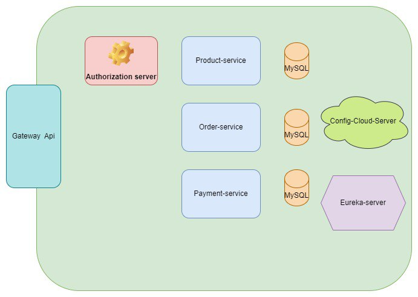
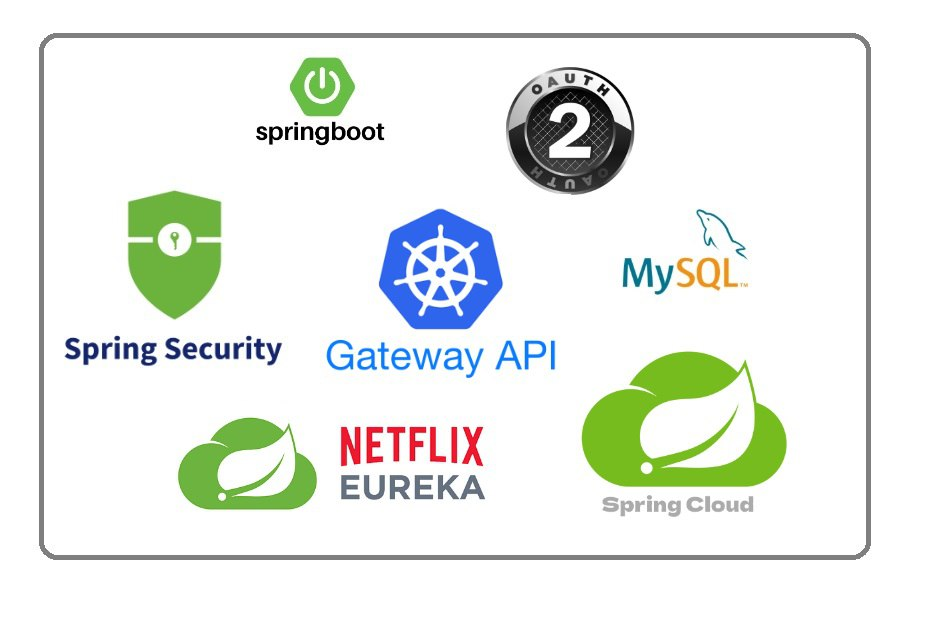
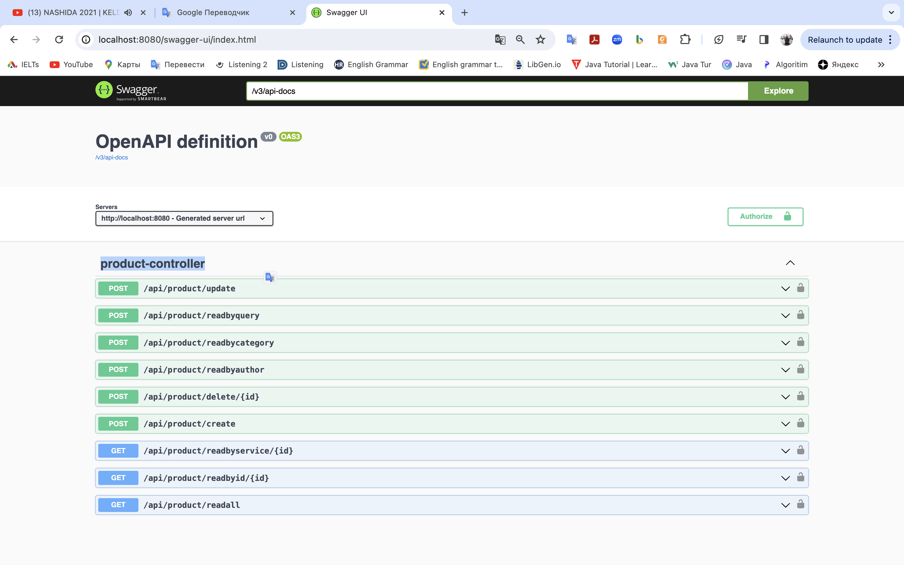
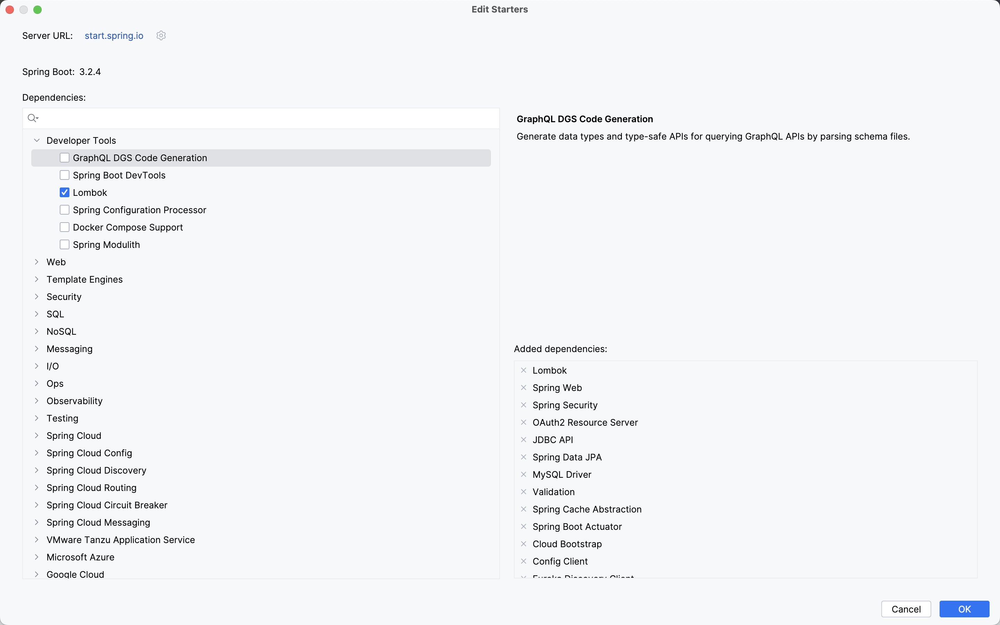
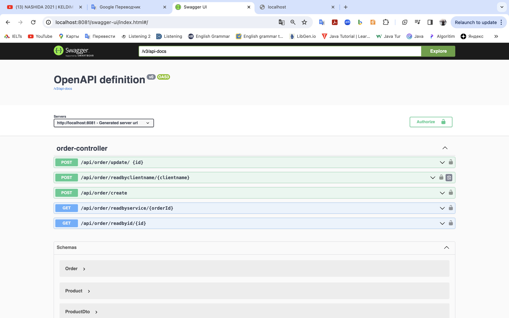
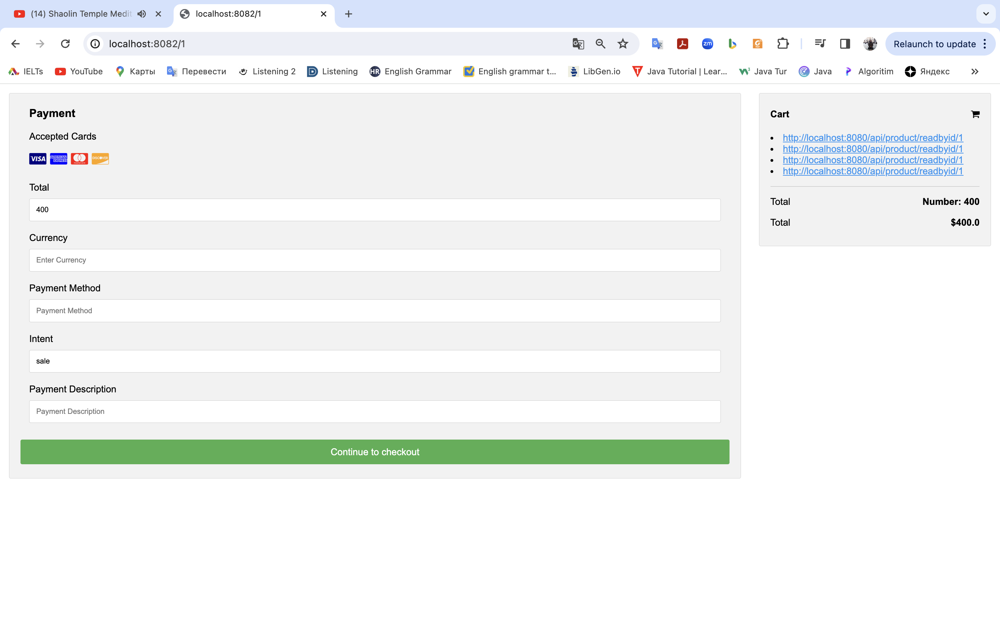

# Simple ecommerce microservices in spring boot 

## General structure of microservices

## Technologies

### I) Product-service

#### a) Technologies

#### b) UI for REST-API of product-service (Swagger)

Url: http://localhost:8080/swagger-ui/index.html

### II)  Order-service

#### a) Technologies

#### b) UI for REST-API of order-service (Swagger)

Url: http://localhost:8081/swagger-ui/index.html

###  III) Payment-service

#### a) Technologies

##### b) We use PayPal 

#### c) UI for REST-API of order-service (Swagger)

Url: http://localhost:8082/{orderID}

